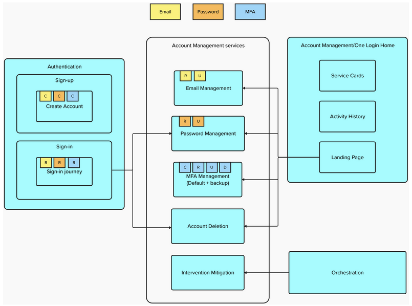
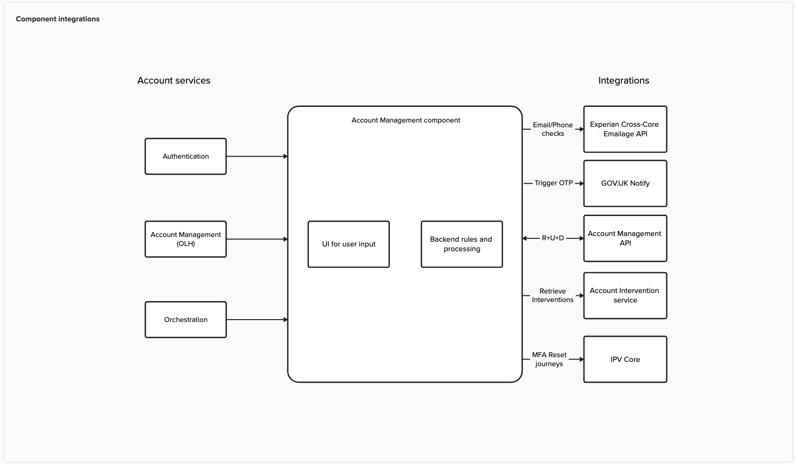
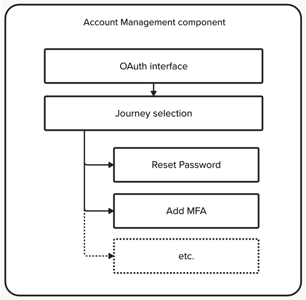
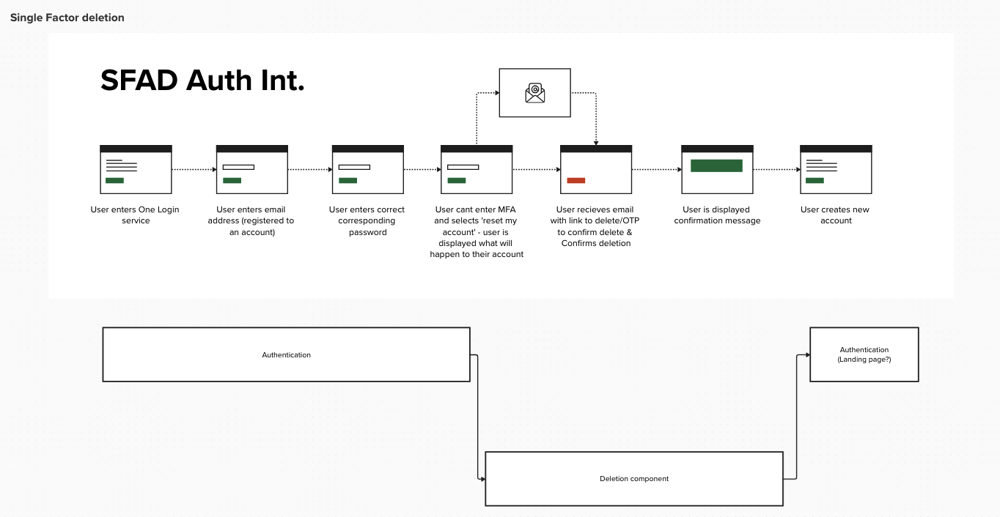
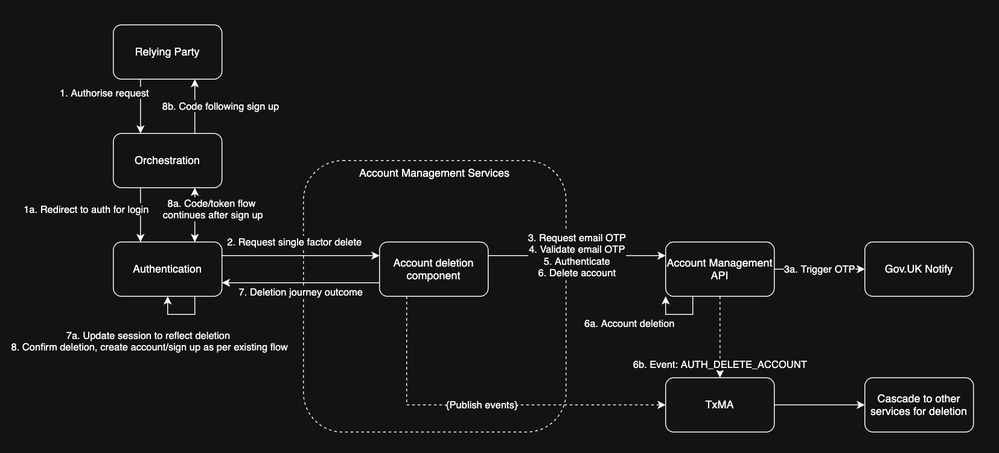

# Account Components (Account Management Services)

**Initiative Owner: [One Login Home team](https://team-manual.account.gov.uk/teams/home-team/#one-login-home)**  
**DRB:**

- [DRB0042](https://govukverify.atlassian.net/wiki/spaces/Architecture/pages/5431263407/DRB042+2025-06-05+-+Account+Management+Components)
- [Presentation](https://docs.google.com/presentation/d/1pN8HN86O1Xg3enxloj9L5g5eFBnnZ2i2JSrsKWg3LlI/edit?slide=id.g2af76eabea2_0_41#slide=id.g2af76eabea2_0_41)
- [Confluence](https://govukverify.atlassian.net/wiki/spaces/Architecture/pages/5439193090/Account+Management+services)
- [Mural](https://app.mural.co/t/governmentdigitalservice1334/m/governmentdigitalservice1334/1744631354683/a46e462533ff7478a90800b527c75adcd706ee0f)

The purpose of the Account Components solution is to make common user journeys reusable instead of having to duplicate them.
For example, the journey to change a password exists in both Home and Auth with their own implementations, therefore content and functionality is duplicated across two codebases and thus requires effort to ensure functional and content parity.
By creating Account Components solution, common journeys shall become reusable and consistent and only reside in this single codebase.

## Why

- Similar journeys replicated across systems
- Services overloaded with functions that could be offloaded into other services
- Limited scalability for future requirements, eg: Multiple intervention mitigations
- Leads to complexities with service maintenance and duplication of features.

## Target Proposal

Create new components for account management features.
The new component has defined boundaries for the tasks it is responsible for.
Features can evolve independently - reduced dependency between teams
Model can scale to support future requirements such as additional interventions
Simplifies the authentication service and helps account services move closer to the Tier 1 model.

- Clients invoke individual components for Account Management through an OAuth call - scoped for the function that the component is expected to perform.
- Each component encapsulates required UI screens and processing logic for the action to be performed (eg: password reset, email update etc)
- Post-auth journeys use the Auth access token issued for the user to invoke account management APIs
- Pre-auth journeys (password/MFA reset) will need to use a generated Orch token to access APIs on behalf of the user
  

### Benefits

- Services have defined boundaries for the tasks they are responsible for
- Features can evolve independently - reduced dependency on teams
- Model can scale to support future requirements such as additional interventions

### Structure

To reduce the maintenance cost, the account management service will form a single service with different modules within it.  

- A single OAuth interface will sit over multiple separate journey flows.
- Auth and One Login Home will control journey selection directly (via OAuth claims)
- Orchestration will rely on journey selection to call AIS to select appropriate intervention journeys

### High-level Flows

#### Initiated by an external RP, where Auth determine they need to perform a common journey.

1. User Initiates Login: A user requests to sign in to a Relying Party (RP) that is supported by One Login which is the OAuth Provider (OP).
2. RP Redirects the User to OP: The RP redirects the user's browser to the OP's authorization endpoint, including its Client ID, a Redirect URI, and requested Scopes.
3. User Authenticates: The OP prompts the user for their credentials and determines if the user needs to perform any common tasks.
4. OP requires user to conduct a common journey: The OP redirects the user's browser to the Account Component's OAuth Provider's authorization endpoint, including the OPs Client ID, a Redirect URI, and requested Scopes and then is redirected to a common journey.
5. User conducts a common Journey: User conducts the common journey and the outcome is stored, the user is redirected back to the OP.
6. The OP acquires the outcome of the common Journey: The OP uses the auth code returned by Account Component to get the user's info and renders the outcome of the common journey.
7. If successful, it grants consent for the RP to access their information.
8. OP Returns Authorization Code: The OP redirects the user's browser back to the RP's registered redirect URI, appending an authorization code in the URL.
9. RP Exchanges Code for Tokens: The RP then directly contacts the OP's token endpoint, providing its client ID, client secret, the authorization code, and redirect URI to request ID and access tokens.
10. OP Issues Tokens: The OP verifies the information and issues a JSON payload containing an ID Token, an Access Token, and potentially a refresh token to the RP.
11. RP Uses Tokens: The RP calls the UserInfo endpoint to get user claims or other protected resources.

#### Initiated by Home RP, where the user chooses to perform a common journey.

1. User signs into the Home RP: User signs-in to Home frontend which is supported by One Login as the OAuth Provider (OP).
2. User selects a common journey: Home redirects the user's browser to the Account Component's OAuth Provider's authorization endpoint, including the Home's Client ID, a Redirect URI, and requested Scopes and then is redirected to a common journey.
3. User conducts a common Journey: User conducts the common journey and the outcome is stored, the user is redirected back to the Home RP.
4. The Home RP acquires the outcome of the common Journey: The Home RP uses the auth code returned by Account Component to get the user's info and renders the outcome of the common journey.

## Journey Components (Common Journeys)

### Account Deletion

#### Why

Users who lose access to their MFA had to contact the TSD in order to trigger an account deletion.
This was a lengthy and inefficient process in which the TSD can’t authenticate legitimate access of the account.

#### What

Self serve account deletions enables users who have lost access to their MFA to delete their account and create a fresh one, allowing them to gain access to One Login and other gov services using their chosen email.
Users will perform a ‘low confidence’ authentication receiving an OTP to the email address associated with their account.
Doing so will gain the user access to the account deletion component in which they can trigger an account deletion from.

Intended to be used by:

- Auth for Single Factor (Self-Serve) Account Deletion (scope: `account-delete`)  
  

  
  - Jira
    - [DCP-4833](https://govukverify.atlassian.net/browse/DCP-4833)
    - [DFDT-150](https://govukverify.atlassian.net/browse/DFDT-150)
    - [DIAR-2458](https://govukverify.atlassian.net/browse/DIAR-2458)
    - [OLH-2597](https://govukverify.atlassian.net/browse/OLH-2597)
    - [OLH-2907](https://govukverify.atlassian.net/browse/OLH-2907)
  - Confluence
    - [DCP-4833](https://govukverify.atlassian.net/wiki/spaces/DID/pages/5420318728/DCP-4833+Self+Service+Account+Deletion)
    - [High-level Design](https://govukverify.atlassian.net/wiki/spaces/Architecture/pages/5489918396/DCP-4833+Self+Service+Account+Deletion)
  - Mural:
    - [Auth Journey](https://app.mural.co/t/governmentdigitalservice1334/m/governmentdigitalservice1334/1744894473873/4a08811019ebb0ddc1a130d8d9c969db01693ad9)
    - [Low-level Design](https://app.mural.co/t/governmentdigitalservice1334/m/governmentdigitalservice1334/1756821406746/f0c3f14d9be281812db1dc7dc95aa515a6baddda)
  - [Slack](https://gds.slack.com/archives/C08Q6T044TU)

- Home frontend for Deleting OL Account (TODO)

### Future Common Journey Components

- #### Password Management
- #### MFA Management
- #### Email Management
- #### Intervention Mitigations
- #### Passkey Management
