# Account Components — Architecture

```mermaid
graph TB
    %% ===== EXTERNAL ACTORS =====
    User([User / Browser])
    RP([Relying Party Client])
    TxMA([TxMA\nAudit Platform])
    GOVUKNotify([GOV.UK Notify\nEmail Service])

    %% ===== EDGE LAYER =====
    subgraph Edge["Edge Layer (us-east-1)"]
        WAF_CF[WAF WebACL]
        CloudFront[CloudFront\nDistribution]
        ACM_Virginia[ACM Certificate\nus-east-1]
    end

    %% ===== FRONTEND PATH =====
    subgraph FrontendPath["Frontend (eu-west-2)"]
        CloakingWAF[Cloaking WAF]
        FrontendAPIGW[API Gateway\nRegional / Public]
        FrontendLambda[Frontend Lambda\nFastify + Nunjucks]
    end

    %% ===== PRIVATE API PATH =====
    subgraph APIPath["Private API (eu-west-2)"]
        PrivateAPIGW[API Gateway\nPrivate / VPC Endpoint]
        TokenLambda[Token Lambda\nPOST /token]
        JourneyOutcomeLambda[Journey Outcome Lambda\nGET /journeyoutcome]
        HealthcheckLambda[Healthcheck Lambda\nGET /healthcheck]
        JWKS_S3_Integration[S3 Integration\nGET /.well-known/jwks.json]
        OAuthDiscovery[Mock Integration\nGET /.well-known/oauth-authorization-server]
    end

    %% ===== CORE LAMBDAS =====
    subgraph Core["Core Lambdas (eu-west-2)"]
        NotificationsLambda[Notifications Service\nLambda]
        JWKSCreatorLambda[JWKS Creator\nLambda\nCloudFormation Custom Resource]
    end

    %% ===== DATA STORES =====
    subgraph DataStores["Data Stores"]
        DDB_Sessions[(DynamoDB\nSessions)]
        DDB_AuthCode[(DynamoDB\nAuth Codes)]
        DDB_JourneyOutcome[(DynamoDB\nJourney Outcomes)]
        DDB_ReplayAttack[(DynamoDB\nReplay Attack)]
    end

    %% ===== MESSAGING =====
    subgraph Messaging["SQS Queues"]
        AuditQueue[Audit Events Queue\n+ DLQ]
        NotificationsQueue[Notifications Queue\n+ DLQ]
    end

    %% ===== KMS KEYS =====
    subgraph KMS["KMS Keys"]
        JARKey[JAR RSA Encryption Key\nRSA-2048 / ENCRYPT_DECRYPT]
        JWTKey[JWT Signing Key\nECC P-256 / SIGN_VERIFY]
        DDBKey[DynamoDB SSE Key\nSymmetric]
        SQSKey[SQS Encryption Key\nSymmetric]
        LambdaEnvKey[Lambda Env Var Key\nSymmetric]
        S3Key[S3 SSE Key\nSymmetric]
        CWKey[CloudWatch Key\nSymmetric]
        TxMAKey[TxMA Queue Key\nSymmetric]
    end

    %% ===== OTHER AWS SERVICES =====
    subgraph Config["Configuration"]
        AppConfig[AppConfig\nOperational Profile]
        SSM[SSM Parameters\nMock Client Keys]
        SecretsManager[Secrets Manager\nNotify API Key\nSession Secret]
    end

    subgraph Storage["Storage"]
        JWKSBucket[S3 Bucket\nJWKS Store]
        AccessLogsBucket[S3 Bucket\nAccess Logs]
    end

    subgraph Observability["Observability"]
        CloudWatch[CloudWatch\nLogs + Metrics + Alarms]
        XRay[X-Ray\nTracing]
        Dashboard[CloudWatch Dashboard]
        Dynatrace[Dynatrace\nOneAgent Layer + RUM]
    end

    subgraph Networking["Networking"]
        VPC[VPC\nPrivate/Protected Subnets]
        R53[Route 53\nHosted Zone]
        ACM_London[ACM Certificate\neu-west-2]
    end

    subgraph CICD["CI/CD"]
        CodeDeploy[CodeDeploy\nCanary Deployments]
        CodeSigning[Code Signing\nLambda Integrity]
    end

    %% ===== EXTERNAL APIs =====
    subgraph ExternalAPIs["External APIs"]
        AccountMgmtAPI[Account Management API]
        AccountDataAPI[Account Data API]
    end

    %% ===== REQUEST FLOW: USER → FRONTEND =====
    User --> WAF_CF
    WAF_CF --> CloudFront
    CloudFront --> CloakingWAF
    CloakingWAF --> FrontendAPIGW
    FrontendAPIGW --> FrontendLambda

    %% ===== REQUEST FLOW: RP → PRIVATE API =====
    RP --> PrivateAPIGW
    PrivateAPIGW --> TokenLambda
    PrivateAPIGW --> JourneyOutcomeLambda
    PrivateAPIGW --> HealthcheckLambda
    PrivateAPIGW --> JWKS_S3_Integration
    PrivateAPIGW --> OAuthDiscovery
    JWKS_S3_Integration --> JWKSBucket

    %% ===== FRONTEND LAMBDA → AWS SERVICES =====
    FrontendLambda --> DDB_Sessions
    FrontendLambda --> DDB_AuthCode
    FrontendLambda --> DDB_JourneyOutcome
    FrontendLambda --> DDB_ReplayAttack
    FrontendLambda --> JARKey
    FrontendLambda --> AppConfig
    FrontendLambda --> AuditQueue
    FrontendLambda --> NotificationsQueue
    FrontendLambda --> AccountMgmtAPI
    FrontendLambda --> AccountDataAPI

    %% ===== TOKEN LAMBDA → AWS SERVICES =====
    TokenLambda --> DDB_AuthCode
    TokenLambda --> DDB_ReplayAttack
    TokenLambda --> JWTKey
    TokenLambda --> AppConfig

    %% ===== JOURNEY OUTCOME LAMBDA → AWS SERVICES =====
    JourneyOutcomeLambda --> DDB_JourneyOutcome
    JourneyOutcomeLambda --> JWTKey

    %% ===== CORE LAMBDAS =====
    NotificationsQueue --> NotificationsLambda
    NotificationsLambda --> SecretsManager
    NotificationsLambda --> GOVUKNotify

    JWKSCreatorLambda --> JARKey
    JWKSCreatorLambda --> JWKSBucket

    %% ===== AUDIT =====
    AuditQueue --> TxMA

    %% ===== DNS =====
    R53 --> CloudFront
    R53 --> FrontendAPIGW
```

## Component Summary

### Frontend (User-Facing)

| Component            | Description                                                                                                                  |
| -------------------- | ---------------------------------------------------------------------------------------------------------------------------- |
| CloudFront           | CDN distribution with WAF WebACL for DDoS/bot protection                                                                     |
| Cloaking WAF         | Protects API Gateway origin; ensures traffic only comes via CloudFront                                                       |
| Frontend API Gateway | Regional API Gateway with custom domain (`manage.{env}.account.gov.uk`)                                                      |
| Frontend Lambda      | Fastify app (Node.js 24) serving SSR HTML via Nunjucks. Handles OAuth authorize, passkey-create, and account-delete journeys |

### Private API (Machine-to-Machine)

| Component              | Description                                                                           |
| ---------------------- | ------------------------------------------------------------------------------------- |
| Private API Gateway    | VPC Endpoint-restricted API. Exposes OAuth/OIDC endpoints to relying party clients    |
| Token Lambda           | Exchanges authorization codes for access tokens (OAuth `POST /token`)                 |
| Journey Outcome Lambda | Returns journey results to relying parties (`GET /journeyoutcome`)                    |
| JWKS endpoint          | Serves `jwks.json` from S3 via API Gateway integration (`GET /.well-known/jwks.json`) |
| OAuth Discovery        | Mock API Gateway response for `/.well-known/oauth-authorization-server`               |

### Core Lambdas

| Component             | Description                                                                                    |
| --------------------- | ---------------------------------------------------------------------------------------------- |
| Notifications Service | Triggered by SQS. Reads Notify API key from Secrets Manager and sends emails via GOV.UK Notify |
| JWKS Creator          | CloudFormation Custom Resource. Exports the JAR RSA public key as JWKS to S3 on deploy         |

### Data Stores

| Store                       | Purpose                                                         |
| --------------------------- | --------------------------------------------------------------- |
| DynamoDB — Sessions         | Stores user session data                                        |
| DynamoDB — Auth Codes       | Short-lived authorization codes (exchanged via `/token`)        |
| DynamoDB — Journey Outcomes | Records of completed journeys (retrieved via `/journeyoutcome`) |
| DynamoDB — Replay Attack    | JTI nonce storage to prevent token replay                       |

### Messaging

| Queue                       | Purpose                                                               |
| --------------------------- | --------------------------------------------------------------------- |
| Audit Events Queue (+ DLQ)  | Sends TxMA audit events to cross-account TxMA platform                |
| Notifications Queue (+ DLQ) | Sends email notification requests to the Notifications Service Lambda |

### KMS Keys

| Key                       | Type                       | Purpose                                                                  |
| ------------------------- | -------------------------- | ------------------------------------------------------------------------ |
| JAR RSA Encryption Key    | RSA-2048 / ENCRYPT_DECRYPT | Decrypts incoming JAR tokens from relying parties                        |
| JWT Signing Key           | ECC P-256 / SIGN_VERIFY    | Signs access tokens issued by the Token Lambda                           |
| DynamoDB SSE Key          | Symmetric                  | Encrypts all DynamoDB tables at rest                                     |
| SQS Encryption Key        | Symmetric                  | Encrypts Notifications Queue messages                                    |
| TxMA Queue Encryption Key | Symmetric                  | Encrypts Audit Events Queue messages (cross-account decryptable by TxMA) |
| Lambda Env Var Key        | Symmetric                  | Encrypts Lambda environment variables at rest                            |
| S3 SSE Key                | Symmetric                  | Encrypts objects in the JWKS S3 bucket                                   |
| CloudWatch Encryption Key | Symmetric                  | Encrypts CloudWatch log groups                                           |

### Configuration & Secrets

| Service             | Purpose                                                                |
| ------------------- | ---------------------------------------------------------------------- |
| AppConfig           | Operational config: TTLs, client registry, feature flags (5-min cache) |
| Secrets Manager     | GOV.UK Notify API key; session signing secret                          |
| SSM Parameter Store | Mock client EC/RSA keys (dev/build environments only)                  |

### Observability

| Service              | Purpose                                                                                                              |
| -------------------- | -------------------------------------------------------------------------------------------------------------------- |
| CloudWatch Logs      | Structured logs from all Lambdas (encrypted, 30-day retention)                                                       |
| CloudWatch Metrics   | Custom metrics via Powertools (authorize errors, journey completion, passkey creation, notification success/failure) |
| CloudWatch Alarms    | Availability, error rate, latency, throttle, and DLQ depth alarms → SNS → Slack                                      |
| CloudWatch Dashboard | Unified operational dashboard with journey, passkey, and notification widgets                                        |
| X-Ray                | Distributed tracing (Active tracing on all Lambdas and API Gateways)                                                 |
| Dynatrace            | OneAgent Lambda layer + RUM for APM                                                                                  |

### Networking & DNS

| Service  | Purpose                                                                                   |
| -------- | ----------------------------------------------------------------------------------------- |
| VPC      | Lambdas deployed in Private/Protected subnets with VPC endpoints for AWS services         |
| Route 53 | DNS for `manage.{env}.account.gov.uk` (A record alias to CloudFront + API Gateway origin) |
| ACM      | TLS certificates in both `us-east-1` (CloudFront) and `eu-west-2` (API Gateway)           |

### CI/CD & Security

| Service              | Purpose                                                                                |
| -------------------- | -------------------------------------------------------------------------------------- |
| SAM / CloudFormation | Infrastructure-as-code for all application resources                                   |
| Terraform            | Infrastructure for VPC, CloudFront, pipelines, certificates, hosted zone, ECR, signing |
| CodeDeploy           | Canary Lambda deployments (10% / 10-30 min) with automatic rollback on alarm           |
| Code Signing         | Lambda code signing via AWS Signer for integrity verification                          |
| Audit Hooks          | Lambda and infrastructure CloudFormation audit hooks                                   |
